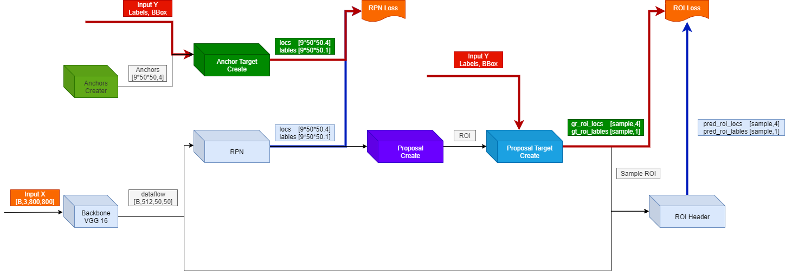
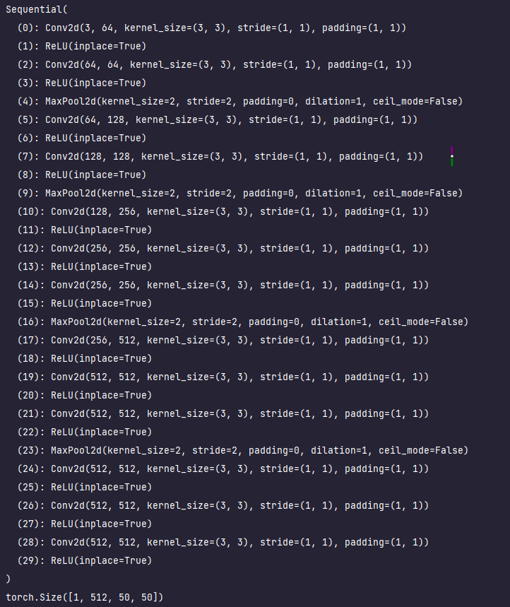

# faster_rcnn

## Forward



---

### Nets

1. Backbone(VGG16)

    the 30th layer of features is relu of conv5_3
- 输入： [N,3,800,800]
- 输出： [N,512,50,50]

```
fe_extractor, cls = get_feature_extractor_classifier()
fe_extractor = fe_extractor.cuda()

images = to_device(torch.Tensor(1, 3, 800, 800)).float()
features = fe_extractor(images)
print(features.shape)
```


2. RPN
3. ROI Header

---
### Targets
1. AnchorCreator 
   用于生成特征图[50*50] 对应的 Anchors
2. AnchorTargetCreator
- 查看一幅图像中的目标，并将它们分配给包含它们的特定的 AnchorBox
- 这将用于 RPN loss 的计算
- 与ground-truth-box重叠度最高的Intersection-over-Union (IoU)的anchor
- 与ground-truth box 的IoU重叠度大于0.7的anchor
- 对所有与ground-truth box的IoU比率小于0.3的anchor标记为负标签
- anchor既不是正样本的也不是负样本，对训练没有帮助

3. ProposalCreator
4. ProposalTargetCreator

### Issue
1. 训练过程中模型输出为nan
   - 经过反复尝试，大致是因为学习率过大不匹配，导致梯度爆炸
   - 同时修复   只选取Label正确的Box计算ROI loc 损失
   - 同时修复   直传递对应的Box到anchor target creator 和 proposal target creator