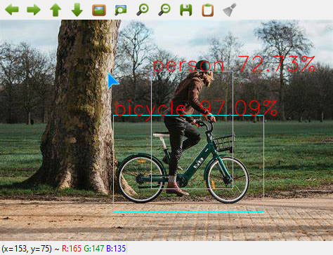

# Faster_Rcnn
***
### 链接
[一文教你如何用PyTorch构建 Faster RCNN](https://zhuanlan.zhihu.com/p/56710152) 

[GitHub Faster-CNN](https://github.com/xin-pu/faster_rcnn)

## Forward


整个Faster RCNN训练时网络如图所示：
1. 网络层
   - BackBone 特征提取层
   - RPN 候选框提取网络
   - ROI Header 对候选框分类和位置校正
2. 标签分配
   - Anchor Creator
   - Anchor Target Creator
   - Proposal Creator
   - Proposal Target Creator
3. 损失函数
   - RPN损失
   - ROI损失

数据流：
1. 准备数据， X(Image), Y(Box, Label)
2. X经过Backbone提取特征 
3. 再经过候选框提取网络得到候选框位置和目标预测分值
4. Anchor Creator生成Anchor在图像上候选框，再结合Y信息，得到目标候选框
5. 预测候选框通过Proposal Creator 生成感兴趣区域ROI
6. 所有ROI结合Y信息通过Proposal Target Creator得到 Sample ROI即建议位置，以及这些位置的Ground truth位置和分类
7. Sample ROI 通过ROI Header 生成每个建议位置的 位置和类别预测结果
8. 通过3,4得到 RPN Loss
9. 通过6,7计算 ROI Loss

具体每个网络层结构和Creator逻辑可以结合引用的文章理解。

---
### Note
- 这个项目基本基于Pytorch, 主要文件没有使用到numpy库。
- cfg目录下是配置文件
- nets目录下为三个网络层
- targets目录下为四个Creator.
- utils 下有Faster-RCNN中计算IOU和位置校正的方法 
- 默认基于GPU运行，如果需要切换到CPU,可以修改utils/to_tensor.py中的cpu改为True
- 
### Issue
复现时遇到的问题：
1. 源代码中只能以BatchSize =1训练，本项目修改了一下可以设置Batch Size.
2. 损失函数根据最新的代码也调整了下， 与知乎文章的损失不同。
3. 训练过程中模型输出为nan
   - 经过反复尝试，大致是因为学习率过大不匹配，导致梯度爆炸
   - 同时修复   只选取Label正确的Box计算ROI loc 损失
   - 同时修复   直传递对应的Box到anchor target creator 和 proposal target creator

### Train
训练时先加载配置文件，再以配置文件创建训练器，然后开始训练
训练过程中每个迭代loss减小就会覆盖保存
```
my_plan = TrainPlan("cfg/voc_train.yml")
my_plan.pre_train = True
trainer = Train(my_plan)
trainer()
```
训练日志如下：
近似联合训练法
loss 和面对应的四个数值分别是 rpn-locs, rpn-cls, roi-locs, roi-cls，可观察每部分损失变化


### Predict

测试代码和结果如下，因为训练还不足，结果还不到火候。

```
cfg = TrainPlan("cfg/voc_train.yml")
predictor = Predict(cfg)
testfile = r"E:\OneDrive - II-VI Incorporated\Pictures\Saved Pictures\R2.jfif"
res = predictor(testfile)

predict_image = get_predict_image(testfile, res[0], res[1], res[2])
cv2.imshow("Result", predict_image)
cv2.waitKey(5000)
```


